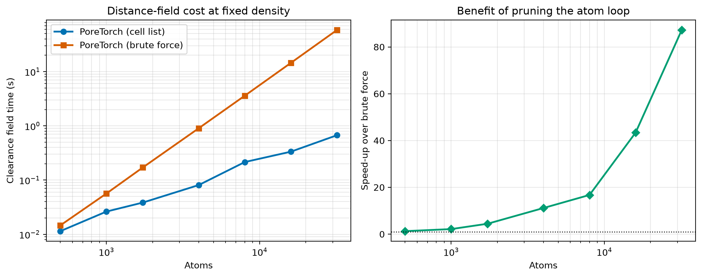
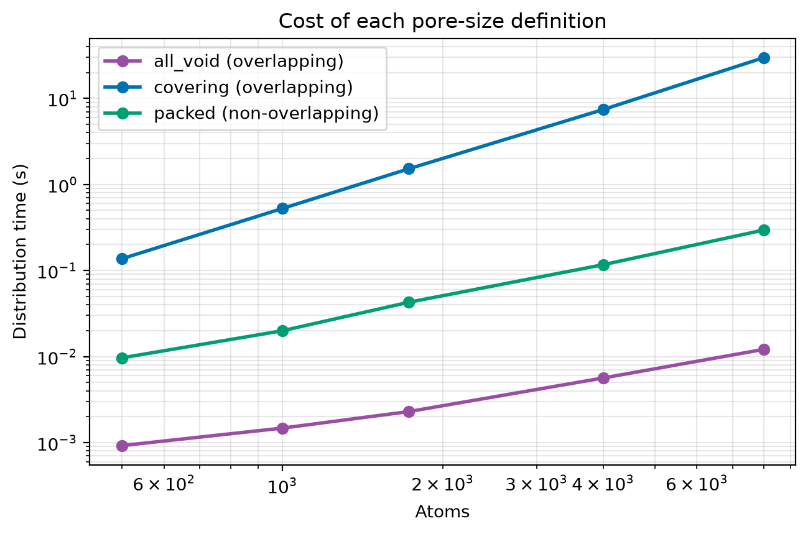

---

Geometric pore-size distributions for porous and amorphous materials, GPU-accelerated with PyTorch. Three standard pore-size definitions on one shared largest-empty-sphere field, exact minimum-image handling in cells of any shape, and periodic pore labelling that tells a closed pocket from a channel. Works with ASE `Atoms` or any structure file ASE can read.

> **GPU recommended, not required.** Everything runs on the CPU with `device="cpu"`, just slower.

## Install

Latest release:
```
pip install PoreTorch
```
For development:
```
git clone https://github.com/joehart2001/PoreTorch.git
cd PoreTorch
pip install -e .
```

## Quickstart

```python
from ase.io import read
from poretorch import psd, plot_psd

atoms = read("carbon.data", format="lammps-data", atom_style="atomic")

result = psd(
    atoms,
    method="all_void",   # or "covering" (PoreBlazer-style), or "packed"
    grid_spacing=0.3,    # A, the main convergence parameter
    probe_radius="N2",   # accessibility threshold, or 0.0 for the bare void
    bin_width=0.25,      # A, diameter bins
    output="psd.csv",    # optional, also takes .npz and .json
)

print(result.stats["median_diameter_A"], "A median pore diameter")
plot_psd(result, path="psd.png")
```

`psd()` takes an ASE `Atoms`, an iterable of `Atoms`, or a path. Pass several frames and you get the ensemble mean with a standard error per bin, which is what you want for amorphous structures where one configuration is one noisy sample:

```python
frames = read("anneal.extxyz", index="-10:")
result = psd(frames, method="covering")
result.se_dV_dd_cc_per_nm_per_g      # error band, ready to plot
```

Reported quantities convert on demand from the convention-free per-bin volume:

```python
result.diameters_A                   # bin centres
result.volume_A3                     # void volume per bin
result.dV_dd_cc_per_nm_per_g         # as adsorption data is reported
result.normalised                    # unit area, for comparing shapes
result.cumulative_fraction
```

For the pores themselves, not just their sizes:

```python
from poretorch import analyse

out = analyse(atoms, method="covering", probe_radius="N2")
print(out.field.porosity, out.field.specific_void_volume)
print(out.labels.summary())
for pore in out.labels.percolating():
    print(pore.id, pore.kind, pore.volume, pore.percolation_vectors)
```

## The three methods

All three read the same distance field and differ only in what "the pore size at this point" means.

| `method` | Spheres | Size of a point | Closest analogue |
|---|---|---|---|
| `all_void` | **overlapping** | the largest empty sphere centred **on** it | Gelb-Gubbins geometric PSD |
| `covering` | **overlapping** | the largest empty sphere anywhere that **contains** it | PoreBlazer, Zeo++ |
| `packed` | **non-overlapping** | the packed sphere it belongs to | geometric skeleton of the void |

`"poreblazer"` is an alias for `covering`, and `"sphere_packing"` for `packed`.

### Overlapping or not

`all_void` and `covering` put a sphere at **every** void point, each as large as fits there, so those spheres overlap almost completely: a point and its neighbour carry nearly the same sphere. Nothing rejects an overlap, and nothing needs to.

`packed` is the odd one out. It walks candidate spheres largest-first and accepts one only if it clears every sphere already accepted, so the accepted set is **disjoint**. That makes it a partition of the void rather than a smoothed local average, at the cost of the interstitial gaps a packing necessarily leaves.

Overlap decides which *size* a point is labelled with, not how much volume it contributes, so none of the three double-counts void volume:

- `all_void` and `covering` weight each void **voxel** by its own voxel volume, counted exactly once. However much the spheres overlap, both integrate to the accessible void volume.
- `packed` weights each **sphere** by its sphere volume, which is only sound because the spheres are disjoint. It integrates to the packed volume, below the void volume by the gaps. `stats["filling_fraction"]` reports the shortfall, typically around 0.2 to 0.3.

`covering` is never smaller than `all_void` at any point, so it always sits at larger diameters.

Pores are labelled across periodic boundaries and classified by how far they extend: `closed`, `channel`, `planar` or `network`. That comes from a real percolation test, whether the pore can be traced back to itself in a *different* periodic image, rather than from checking whether it touches two opposite faces, which a small pocket straddling a boundary also passes.

See [`docs/source/methods.md`](docs/source/methods.md) for the definitions in full.

## Performance



The `cell_list` backend bins atoms once and examines only the bins around each grid point, so the clearance field is linear in grid size and effectively independent of atom count. Measured on an RTX 5090, random structures at 0.05 atoms per cubic Angstrom, 0.4 A grid spacing:

| Atoms | Grid points | `cell_list` | `brute` | Speed-up |
|---|---|---|---|---|
| 500 | 157k | 0.011 s | 0.015 s | 1.3x |
| 1000 | 314k | 0.026 s | 0.057 s | 2.2x |
| 1728 | 551k | 0.038 s | 0.171 s | 4.4x |
| 4000 | 1.26M | 0.081 s | 0.901 s | 11x |
| 8000 | 2.52M | 0.215 s | 3.597 s | 17x |
| 16000 | 5.00M | 0.334 s | 14.5 s | 43x |
| 32000 | 10.08M | 0.672 s | 58.6 s | 87x |

The speed-up grows without bound because only `brute` carries the atom-count factor. Reproduce with `python -m benchmarks.benchmark`.

Both backends are **exact**, and not just close. Every cell-list query returns a value together with a flag saying whether the searched bins provably reached far enough to have found the true nearest surface. Unresolved points are retried on a wider ring, and once a wider ring would examine more candidate slots than there are atoms, `brute` finishes the job. The test suite asserts the two agree bit for bit, for uniform and per-atom radii, on cells from cubic to strongly sheared.

Among the distributions, `all_void` and `packed` are cheap (0.012 s and 0.295 s at 8000 atoms). `covering` is the expensive one at 29.7 s, quadratic in the number of void points, since in the faithful mode every void point is also a candidate sphere centre. Descending-radius ordering with early exit cuts the constant hard, because the first sphere found to cover a point is already the largest that ever will, so points leave the search as soon as they are assigned. The scaling stands, though, so for large cells use `center_mode="local_maxima"` or subsample with `center_stride`, both of which give a lower bound on the faithful result.



## Validation

The test suite (236 tests) checks the claims rather than just exercising the code:

- **Analytic ground truth.** With one atom, the clearance field must equal the minimum-image distance minus the radius everywhere. It matches to 2e-15.
- **Exact minimum image in any cell.** Displacement lengths agree with `ase.geometry.find_mic` to 5e-15 on cubic, orthorhombic, mildly triclinic and strongly sheared cells. Rather than the naive orthorhombic wrap, which is silently wrong when skewed, PoreTorch reduces to a Minkowski-reduced basis and searches the 27 surrounding images.
- **Backends agree.** `cell_list` reproduces `brute` exactly, including when a distant-but-larger atom wins the minimum, and when bins are deliberately undersized to force ring expansion and fallback.
- **`covering` against its definition.** The early-exit search reproduces a naive all-pairs maximum exactly, on every cell shape.
- **Invariants.** `covering >= all_void` pointwise, `all_void` and `covering` conserve the void volume to 1e-9 relative, packed spheres are pairwise non-overlapping, and the filling fraction stays strictly below one.
- **Percolation.** Channels, planar voids, fully open cells, and pockets that merely straddle a boundary are each classified correctly, including when their axis is made non-periodic.

Run with `pytest`. GPU tests skip themselves when no CUDA device is present.

## Citation

If you use PoreTorch in your work, please cite:
```
@software{PoreTorch,
  author    = {Hart, Joseph},
  title     = {PoreTorch: GPU-accelerated geometric pore-size distributions with PyTorch.},
  year      = 2026,
  version   = {0.1.0}
}
```
