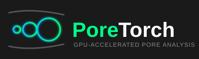

# PoreTorch

PoreTorch computes geometric pore-size distributions from atomistic structures.
It supports periodic triclinic cells, runs on a GPU when one is available, and
falls back to the CPU automatically.

The package accepts ASE `Atoms`, trajectories, and structure files readable by
ASE.

## Installation

From PyPI:

```bash
python -m pip install PoreTorch
```

From the repository:

```bash
git clone https://github.com/joehart2001/poretorch.git
cd poretorch
python -m pip install -e .
```

## Quick start

```python
from ase.io import read
from poretorch import psd, plot_psd

atoms = read(
    "carbon.data",
    format="lammps-data",
    atom_style="atomic",
)

result = psd(
    atoms,
    method="covering",
    grid_spacing=0.3,
    probe_radius="N2",
    bin_width=0.25,
)

print(result.stats["median_diameter_A"])
plot_psd(result, path="psd.png")
```

`device="auto"` is the default. It selects CUDA when available and otherwise
uses the CPU. Pass `device="cpu"` or `device="cuda"` to choose explicitly.

## What is being measured?

At every grid point `g`, PoreTorch computes the clearance to the nearest atomic
surface:

```text
clearance(g) = min_i(distance(g, atom_i) - radius_i)
```

This is the radius of the largest empty sphere centred at `g`. A point is
included when its clearance is at least `probe_radius`.

The probe is an inclusion threshold only. It is not subtracted from the reported
pore radius. For example, an included point with 3.0 A clearance is reported as
a 6.0 A pore diameter, including when an N2 probe was used.

Probe-accessible here means that the probe fits locally. Closed cavities are
included; PoreTorch does not test whether a probe can enter from an external
reservoir.

## Pore-size definitions

| Method | Radius assigned | Histogram weight | Use it for |
|---|---|---|---|
| `all_void` | Clearance at the voxel itself | Voxel volume | Local-clearance distribution |
| `covering` | Largest empty sphere that contains the voxel | Voxel volume | PoreBlazer-style geometric PSD |
| `packed` | Radius of an accepted non-overlapping sphere | Sphere volume | Discrete sphere-packing spectrum |

### `all_void`

Each included voxel is sized by the largest empty sphere centred exactly there.
Every voxel contributes once, so the distribution integrates to the included
void volume unless an explicit filter is applied.

### `covering`

Each included voxel is sized by the largest empty sphere, centred anywhere in
the void, that contains it. The result is never smaller than `all_void` at the
same point.

The default `center_mode="all_void"` evaluates the full grid definition. It can
be expensive for large systems. `center_mode="local_maxima"` and
`center_stride>1` are faster lower-bound approximations.

### `packed`

Local clearance maxima are considered largest-first. A sphere is accepted only
when it does not overlap previously accepted spheres or its own periodic
replicas. Open cell boundaries also cap the sphere radius.

This method describes a set of discrete inscribed spheres. It is not a partition
of the void and its absolute scale should not be compared directly with the two
voxel-weighted methods. `stats["packed_cell_fraction"]` is the packed sphere
volume divided by cell volume.

## Atomic and probe radii

The ASE interface uses `radii="uff"` by default: half the UFF Lennard-Jones
sigma for each element. Other options are:

```python
psd(atoms, radii="vdw")
psd(atoms, radii=1.70)
psd(atoms, radii={"C": 1.70, "O": 1.52})
```

Named probe radii are `"N2"`, `"Ar"`, `"He"`, `"CO2"`, and `"geometric"`.
Atomic radii, probe radius, and grid spacing are part of the definition of a
result and should always be reported with it.

## Results

```python
result.diameters_A
result.volume_A3
result.dV_dd_cc_per_nm_per_g
result.normalised
result.cumulative_fraction
result.stats
```

`volume_A3` is the volume in each diameter bin. The per-gram conversion uses the
atomic masses stored by ASE.

For an ensemble of structures, pass several frames. PoreTorch returns the mean
bin volume and its standard error:

```python
frames = read("anneal.extxyz", index="-10:")
result = psd(frames, method="covering")

result.n_frames
result.se_volume_A3
```

Use `analyse()` when you also need connected pores and percolation information:

```python
from poretorch import analyse

analysis = analyse(atoms, method="covering", probe_radius="N2")

print(analysis.field.porosity)
print(analysis.labels.summary())
```

Pores are classified as `closed`, `channel`, `planar`, or `network` from their
periodic percolation dimensionality.

## Numerical controls

- `grid_spacing` is the main convergence parameter. The default is 0.3 A.
- `bin_width` controls diameter histogram resolution.
- `min_radius` removes smaller radii or packed-sphere candidates.
- `max_diameter` fixes the histogram range. Values outside it raise an error
  unless `allow_truncation=True` is explicitly requested.
- `field_method="cell_list"` is the fast exact backend. `"brute"` is the
  reference implementation.

The grid uses voxel centres and tiles the cell exactly. Minimum-image distances
use a Minkowski-reduced basis, including for skewed triclinic cells.

## Development

```bash
python -m pip install -e ".[dev]"
pytest -q
```

### Documentation

Build the documentation locally with:

```bash
python -m pip install -e ".[docs]"
sphinx-build -W --keep-going -b html docs/source docs/build/html
```

Documentation is deployed to GitHub Pages by `.github/workflows/docs.yml` after
each push to `main`. Enable it once under **Settings → Pages → Source: GitHub
Actions**. The published site will be available at
<https://joehart2001.github.io/poretorch/>.

See [`docs/source/methods.md`](docs/source/methods.md) for the detailed method
definitions and [`docs/source/api.md`](docs/source/api.md) for the API.

PoreTorch is released under the MIT license.
